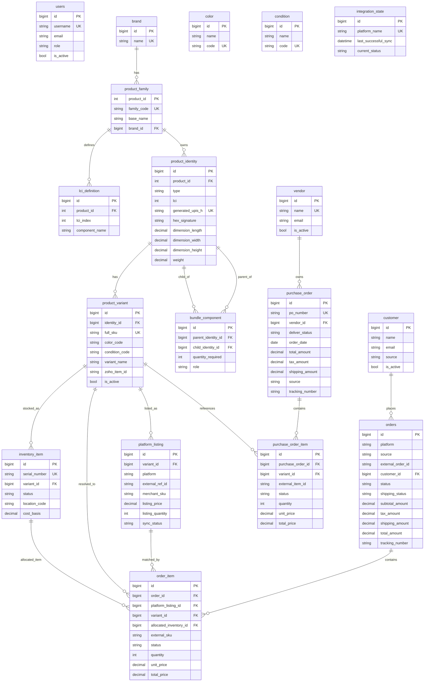

# Database Schema Overview

This document summarizes the current **application-level database schema** defined by SQLAlchemy models in:
- `Backend/app/models/user.py`
- `Backend/app/models/entities.py`
- `Backend/app/models/purchasing.py`
- `Backend/app/modules/orders/models.py`

Scope is the operational domain used by the app runtime: users, catalog/inventory, listings, purchasing, and sales orders.

## 1) Brief Documentation

### Core domain groups
- **Identity & Catalog**: `product_family` -> `product_identity` -> `product_variant`
- **Inventory**: `inventory_item` tracks physical units by `variant_id`
- **External Listing**: `platform_listing` maps internal variants to channel listings
- **Sales Orders**: `orders` + `order_item` + `customer`
- **Purchasing**: `vendor` + `purchase_order` + `purchase_order_item`
- **Sync Runtime**: `integration_state` stores per-platform sync cursor/state
- **Security**: `users` for RBAC login/auth

### Important modeling notes
- `orders` uses `(platform, external_order_id)` unique constraint for idempotent imports.
- `order_item` keeps both `platform_listing_id` and `variant_id` to support matching workflows and fast querying.
- `platform_listing.external_ref_id` is unique per platform when not null (partial unique index).
- `product_variant.full_sku` is globally unique for sellable SKU identity.
- `purchase_order.po_number` is unique for purchasing lifecycle tracking.
- `integration_state.platform_name` is unique: one sync-state row per platform.

## 2) Mermaid ER Diagram (Live Code)

[https://mermaid.live](https://mermaid.live):

