# USAV Solutions ERP — Software Requirements Specification & System Architecture

| Field | Detail |
|---|---|
| **Document ID** | USAV-SRS-001 |
| **Version** | 2.0.0 |
| **Status** | Draft – Pending Review |
| **Date** | 2026-07-28 |
| **Prepared by** | USAV Solutions IT / Development Team |
| **Reviewed by** | @usav.hongquang @IT-USAV |
| **Approved by** | @usav.hongquang |

---

### Revision History

| Version | Date | Author | Description |
|---|---|---|---|
| 1.0.0 | 2026-07-21 | IT Team | Initial draft generated from Business Requirements Document (BRD). |
| 2.0.0 | 2026-07-28 | IT Team | Full rewrite: IEEE 830 structure, 3-column subgraphed Mermaid architecture, module specs, and Confluence sync metadata. |

---

## 1. Introduction & Overview

This document specifies the software requirements and system architecture for the **USAV Solutions Enterprise Resource Planning (ERP)** system. It serves as the single source of truth for engineering teams, product managers, and operations personnel.

---

## 2. Functional Business Requirements Architecture

The high-level architecture breaks down the ERP into 3 primary operational pillars encompassing 7 core domain modules:

```mermaid
graph TB
    %% Styling Definitions
    classDef rootStyle fill:#1e293b,stroke:#0f172a,stroke-width:3px,color:#ffffff,font-weight:bold,font-size:16px;
    classDef catStyle fill:#334155,stroke:#1e293b,stroke-width:2px,color:#f8fafc,font-weight:bold,font-size:14px;
    classDef moduleStyle fill:#0284c7,stroke:#0369a1,stroke-width:2px,color:#ffffff,font-weight:bold,font-size:13px;
    classDef leafStyle fill:#f8fafc,stroke:#cbd5e1,stroke-width:1px,color:#334155,font-size:12px;

    root("USAV Solutions ERP"):::rootStyle

    subgraph CAT1["📦 Operations & Logistics"]
        direction TB
        WO["Warehouse Operations"]:::moduleStyle
        WO1["Receiving"]:::leafStyle
        WO2["Diagnostic Testing"]:::leafStyle
        WO3["Packing Verification"]:::leafStyle

        SC["Security & CCTV"]:::moduleStyle
        SC1["Packer Station Video Sync"]:::leafStyle
        SC2["Timestamp Auditing"]:::leafStyle

        WO --> WO1 & WO2 & WO3
        SC --> SC1 & SC2
    end

    subgraph CAT2["💰 Commercial & Data"]
        direction TB
        PB["Purchasing & Bidding"]:::moduleStyle
        PB1["Pallet Bid Tracking"]:::leafStyle
        PB2["Cost Basis Valuation"]:::leafStyle

        DO["Data Operations"]:::moduleStyle
        DO1["SKU Normalizer"]:::leafStyle
        DO2["Multi-Channel Price Sync"]:::leafStyle

        PB --> PB1 & PB2
        DO --> DO1 & DO2
    end

    subgraph CAT3["📣 Sales & Engagement"]
        direction TB
        LM["Listing & Channel Mgmt"]:::moduleStyle
        LM1["Multi-Account Support"]:::leafStyle
        LM2["Listing Health & Alerts"]:::leafStyle
        LM3["Sales Analytics"]:::leafStyle

        CS["Customer Support"]:::moduleStyle
        CS1["Unified Chat Inbox"]:::leafStyle
        CS2["RMA & Warranty Claims"]:::leafStyle

        MO["Marketing Operations"]:::moduleStyle
        MO1["YouTube Content Pipeline"]:::leafStyle
        MO2["Media Asset Manager"]:::leafStyle

        LM --> LM1 & LM2 & LM3
        CS --> CS1 & CS2
        MO --> MO1 & MO2
    end

    root --> CAT1 & CAT2 & CAT3
```

---

## 3. Domain Module Breakdown

### 3.1 Warehouse Operations (WO)
*   **Receiving (WO1)**: Barcode scanning inbound shipments, bin assignment, item serial tracking.
*   **Diagnostic Testing (WO2)**: Automated and manual hardware testing scripts for refurbished items.
*   **Packing Verification (WO3)**: Weight check and barcode validation at packing benches before label creation.

### 3.2 Security & CCTV (SC)
*   **Packer Station Video Sync (SC1)**: Real-time alignment of packing workbench CCTV streams with active pack orders.
*   **Timestamp Auditing (SC2)**: Frame-accurate timestamp search for customer dispute resolution and shipping claims.

### 3.3 Purchasing & Bidding (PB)
*   **Pallet Bid Tracking (PB1)**: Liquidation and wholesale pallet auction bidding dashboard.
*   **Cost Basis Valuation (PB2)**: Landed cost allocation across manifest items based on condition and grade.

### 3.4 Data Operations (DO)
*   **SKU Normalizer (DO1)**: Unified cross-channel SKU mapping (eBay, Amazon, Ecwid, Walmart).
*   **Multi-Channel Price Sync (DO2)**: Automated price adjustments based on floor margins and competitive rules.

### 3.5 Listing & Channel Management (LM)
*   **Multi-Account Support (LM1)**: Centralized management across multiple merchant accounts per platform.
*   **Listing Health & Alerts (LM2)**: Automated detection of listing suppression, stock-outs, and price drift.
*   **Sales Analytics (LM3)**: Real-time revenue, gross margin, and inventory velocity dashboards.

### 3.6 Customer Support (CS)
*   **Unified Chat Inbox (CS1)**: Consolidated customer messaging queue across eBay, Amazon, and direct web channels.
*   **RMA & Warranty Claims (CS2)**: Customer return workflow, replacement dispatch, and serial number verification.

### 3.7 Marketing Operations (MO)
*   **YouTube Content Pipeline (MO1)**: Video review and product demonstration publishing workflow.
*   **Media Asset Manager (MO2)**: Centralized high-res product photo gallery and listing asset store.
