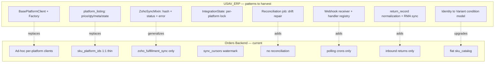
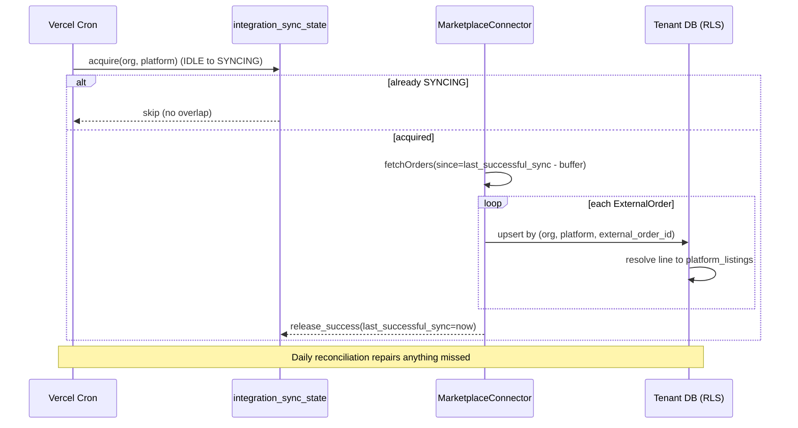

# USAV Orders Backend — Catalog & ERP Enhancement Report

**Reference codebase:** `USAV_ERP` (FastAPI + PostgreSQL "Hub & Spoke" inventory middleware) — cloned to `/tmp/USAV_ERP`
**Target codebase:** `USAV-Orders-Backend` (Next.js App Router + Drizzle/Neon Postgres) — current repo
**Scope:** What to port *into* the Orders Backend, and why.

> **Framing note / correction.** The ERP's catalog is genuinely deeper, but it is **strictly single-tenant** — no `organization_id`, no RLS, no station/staff scoping anywhere (confirmed in `app/models/user.py`, `app/api/deps.py`). The Orders Backend is the opposite: a production-grade `org_id` + RLS-GUC tenancy model (`src/lib/tenancy/db.ts`, `2026-06-14_rls_enforcement_infra.sql`). **So this is not "make the Orders Backend more like the ERP."** It is: *graft the ERP's catalog richness, connector abstraction, and sync discipline onto the Orders Backend without breaking its tenancy guarantees.* Every recommendation below must carry `organization_id` and run inside `withTenantConnection`.

---

## 1. Executive Summary

The Orders Backend has the harder thing already — bulletproof multi-tenancy and a real warehouse (bins, serials, QC). What it lacks is **catalog modeling depth** and **integration *discipline***. Today each marketplace is wired ad-hoc (separate `ebayAccounts`/`amazonAccounts` tables, bespoke routes, no shared client contract), platform listings are a thin 1:1 `sku_platform_ids` mapping with no price/qty/state, and sync is polling-only with idempotency solved once (`zoho_fulfillment_sync`) rather than as a reusable pattern.

The ERP, despite being single-tenant and partly stubbed (Amazon connector is a TODO), has three patterns worth importing wholesale:

1. A **first-class per-channel listing** entity (`platform_listing`) carrying price, quantity, condition, external refs, JSONB metadata, and its own sync state.
2. A **unified connector contract** (`BasePlatformClient` + normalized `ExternalOrder`/`StockUpdate` DTOs + a registration factory) that makes "add a marketplace" a 1-file job.
3. **Sync hygiene as a primitive**: a per-entity sync mixin (`zoho_id`, `last_sync_hash`, `last_synced_at`, `sync_error`, `sync_status`), **SHA-256 hash idempotency**, **echo-loop prevention** (`_updated_by_sync`), a per-platform **sync lock** (`IntegrationState`), and a **nightly reconciliation/drift job**.

### Top 5 recommendations

| # | Recommendation | Impact | Effort | Priority |
|---|---|---|---|---|
| 1 | **First-class `platform_listings` table** (per-channel price/qty/condition/metadata/sync-state), replacing thin `sku_platform_ids` | High | M | Must-have |
| 2 | **Unified connector abstraction** — `MarketplaceConnector` interface + normalized DTOs + registry, refactor eBay/Amazon/Square/Ecwid behind it | High | M–L | Must-have |
| 3 | **Reusable sync-state + hash-idempotency + echo-loop guard** generalized beyond `zoho_fulfillment_sync` to all synced entities | High | M | Must-have |
| 4 | **Nightly reconciliation/drift job** (compare external `last_modified` vs local, repair missed webhooks/failed pushes) | Med-High | S–M | Must-have |
| 5 | **2-tier catalog: Identity → Variant** (immutable spec + condition/color variant) to model used-goods grading natively | High | L | Nice-to-have (high value) |

---

## 2. Detailed Comparison Matrix

| Dimension | USAV_ERP (reference) | USAV Orders Backend (target) | Verdict |
|---|---|---|---|
| **Tenancy** | None. Single org, RBAC only (`UserRole` enum, 5 roles). No `org_id`/RLS/station. | `org_id` on 100+ tables, RLS policies + `SET LOCAL app.current_org` GUC, `staff_roles`-derived permissions, stations. | **Target wins decisively.** Port nothing here; ERP is the cautionary tale. |
| **Product hierarchy** | 3-tier: `product_family` → `product_identity` (immutable spec, dims, class) → `product_variant` (color+condition, `full_sku`). | Flat `sku_catalog` (SKU is atomic) + `items` (Zoho mirror). No variant matrix. | **Ref wins.** Variant/condition modeling fits a used-goods reseller. |
| **Per-channel listings** | `platform_listing`: price, qty, `listing_condition`, `upc`, `platform_metadata` JSONB, `external_ref_id`, sync status/error, M:N to variant. | `sku_platform_ids`: `platformSku`, `platformItemId`, `accountName`, `isActive`. No price/qty/state. | **Ref wins.** Big gap — Orders Backend can't represent channel-specific price/qty. |
| **BOM / bundles** | `bundle_component`: identity-level recipe with roles (`Primary`/`Accessory`/`Satellite`), `quantity_required`, self-ref guard. | `sku_kit_parts`: `componentName`, `qtyRequired`, `isCritical`, `requiredFor`. | **Roughly even.** Adopt the role taxonomy; target's `isCritical` is a nice extra. |
| **Pricing model** | No master price; price lives per-channel on `platform_listing`. Cost per physical unit (`inventory_item.cost_basis`). | `lastKnownCostCents` snapshot on catalog; `items.rate`/`purchaseRate` (Zoho mirror); `partAcquisitions` cost. | **Ref's per-channel price is cleaner**; target's cost capture is comparable. |
| **Connector architecture** | `BasePlatformClient` ABC (`fetch_orders`, `get_order`, `update_stock`, `update_tracking`, `health_check`) + normalized `ExternalOrder`/`StockUpdate` + `PlatformClientFactory`. | Ad-hoc per platform: separate tables, routes, client libs; no shared interface. | **Ref wins.** This is the single biggest maintainability lever. |
| **Sync state tracking** | `ZohoSyncMixin` on every synced entity + per-platform `IntegrationState` (IDLE/SYNCING/ERROR lock) + `ReturnSyncState`. | `sync_cursors` (watermark) + `zoho_fulfillment_sync` (idempotent envelope) + per-account watermarks. Solved per-integration, not generalized. | **Ref's generalization wins**; target's idempotent envelope is excellent and should be the *template* for the generalized version. |
| **Idempotency** | SHA-256 payload hash → skip if unchanged; unique `(platform, external_order_id)`. | Unique `(platform, external_order_id)` + per-reference envelope in `zoho_fulfillment_sync`. | **Even**, different mechanisms. Adopt hash-skip to cut wasted API calls + Neon CU-hrs. |
| **Echo-loop prevention** | Transient `_updated_by_sync` flag checked in ORM listener before re-enqueue. | None (polling-only, so less needed — but needed once webhooks land). | **Ref wins** (matters when you add inbound webhooks). |
| **Inbound (webhooks)** | Zoho webhook receiver + handler registry; fast 200 + background dispatch. | Polling crons only (`vercel.json`); no inbound webhooks. | **Ref wins.** Webhooks cut latency and polling cost. |
| **Bidirectional stock** | `update_stock(updates)` in connector contract (push qty/price out). | Orders-in only for eBay/Amazon/Square; no listing qty/price push-out. | **Ref wins** (interface-level; impls partial). |
| **Reconciliation** | Nightly `tasks/reconciliation.py`: 25h lookback, hash+timestamp compare → inbound/outbound repair. | None. | **Ref wins.** Drift accumulates silently today. |
| **Returns/RMA** | `return_record` (rich `normalized_status` enum) + `return_item` + `ReturnSyncState` + Zoho sales-return sync. | Inbound returns via `receiving.isReturn`; no normalized return dashboard, no outbound RMA. | **Ref wins.** |
| **Layering / DDD** | Clean: `modules/*` (domain) → `repositories/*` (DAO, `BaseRepository[T]`) → `integrations/*`. | Feature-rich but flatter; logic spread across `src/lib/*` + route handlers. | **Ref's repository layer is tidier**; not worth a rewrite, but worth emulating for new catalog/sync code. |
| **Testing** | `tests/` with payload-mapping, normalization, idempotency unit tests. | E2E (Playwright) + route-auth manifest tests; lighter on integration-mapping unit tests. | **Ref's mapper/normalizer unit tests are worth copying** for any connector you port. |

---

## 3. ERP Integration Opportunities (Gap Analysis)

**What the ERP has that the Orders Backend lacks:**



**Best-practice ERP-sync patterns confirmed in the reference, ranked by ROI for the Orders Backend:**

1. **Sync as a reusable mixin, not a per-integration one-off.** The ERP applies one `ZohoSyncMixin` to Customer/Order/Vendor/PO/Variant. The Orders Backend already proved this works once (`zoho_fulfillment_sync` idempotent envelope) — generalize it.
2. **Hash-skip before every outbound push.** Cheap, and directly relevant to your standing Neon CU-hr optimization goal — skipping unchanged syncs avoids both API calls *and* DB writes.
3. **Per-platform sync lock** (`IntegrationState` IDLE→SYNCING→ERROR) prevents overlapping cron runs from double-processing — your crons run every 15m and can overlap on slow runs today.
4. **Reconciliation closes the polling/webhook gap** — the safety net that catches dropped events and failed pushes.
5. **Normalized return records** give a single cross-platform returns view the Orders Backend doesn't have.

**What NOT to port:** the ERP's auth/RBAC, its in-process `asyncio.create_task` queue (single-instance only — wrong for Vercel Fluid Compute; use Vercel Queues/cron instead), and anything assuming a single org.

---

## 4. Actionable Migration Plan (phased)

> Cross-cutting rule for **every** phase: new tables get `organization_id uuid not null references organizations(id)`, all access goes through `withTenantConnection(orgId, …)`, and new mutating routes get the standard guard/Zod/audit treatment (your `api-route-reviewer` + `permission-registry-guard` agents already enforce this).

### Phase 1 — Connector abstraction (Must-have, ~M)
Introduce a shared TypeScript contract mirroring `app/integrations/base.py`, and refactor existing integrations behind it incrementally (adapter-wrap first, don't rewrite).

```ts
// src/lib/integrations/connectors/types.ts
export interface ExternalOrder {
  platformOrderId: string;
  externalOrderNumber?: string;
  status: string;            // raw platform status; mapped separately
  customer: { name?: string; email?: string; /* address… */ };
  items: ExternalOrderItem[];
  subtotalCents: number; taxCents: number; shippingCents: number; totalCents: number;
  currency: string;
  orderedAt?: string;
  raw: unknown;              // keep the original payload (→ platform_data JSONB)
}
export interface StockUpdate { listingId: string; quantity: number; priceCents?: number; }
export interface StockUpdateResult { listingId: string; ok: boolean; error?: string; }

export interface MarketplaceConnector {
  readonly platform: string;
  authenticate(): Promise<boolean>;
  healthCheck(): Promise<boolean>;
  fetchOrders(opts: { since?: Date; until?: Date; status?: string }): Promise<ExternalOrder[]>;
  getOrder(id: string): Promise<ExternalOrder | null>;
  updateStock(updates: StockUpdate[]): Promise<StockUpdateResult[]>;   // bidirectional hook
  updateTracking(orderId: string, tracking: string, carrier: string): Promise<boolean>;
}
```
Register implementations in your existing `connectors/registry.ts` (factory style). Crons then loop connectors generically instead of calling bespoke functions.

**Acceptance criteria:** eBay + Amazon both implement `MarketplaceConnector`; the orders-sync cron iterates `registry.list(orgId)` rather than naming platforms; status mapping centralized in one `mapStatus(platform, raw)` table; existing tests green.

### Phase 2 — First-class platform listings (Must-have, ~M)
Add `platform_listings` (org-scoped) modeled on `platform_listing`, and migrate `sku_platform_ids` data into it.

```sql
create table platform_listings (
  id uuid primary key default gen_random_uuid(),
  organization_id uuid not null references organizations(id),
  sku_catalog_id uuid references sku_catalog(id),      -- nullable: unresolved listings allowed
  platform text not null,
  account_name text,
  external_ref_id text,                                 -- ASIN / eBay listing id
  merchant_sku text,
  listed_name text, listed_description text,
  listing_price_cents integer, listing_quantity integer,
  listing_condition text, upc text,
  platform_metadata jsonb,                              -- channel-specific fields
  sync_status text not null default 'PENDING',          -- PENDING|SYNCED|ERROR
  last_synced_at timestamptz, sync_error text,
  created_at timestamptz default now(), updated_at timestamptz default now()
);
create unique index on platform_listings (organization_id, platform, external_ref_id)
  where external_ref_id is not null;
create index on platform_listings (organization_id, platform, merchant_sku);
```
Then add `platform_listing_id` FK to your order-line table so order items resolve to a channel listing (exactly what migration `0025` did in the ERP).

**Acceptance criteria:** order import resolves line → `platform_listings` row by `(platform, external_ref_id|merchant_sku)`; unresolved listings persist (nullable `sku_catalog_id`) instead of being dropped; `sku_platform_ids` reads proxied or backfilled; RLS policy added.

### Phase 3 — Generalized sync hygiene (Must-have, ~M)
Promote the `zoho_fulfillment_sync` idempotency idea into a reusable shape: add sync columns to each synced entity (or a side `sync_state` table keyed by `(org_id, entity_type, entity_id, target)`), and wrap every outbound push with hash-skip.

```ts
// pseudocode for any outbound push
const payload = buildPayload(entity);
const hash = sha256(stableStringify(payload));
if (hash === entity.lastSyncHash) return; // idempotent skip — saves API + Neon writes
try {
  const remote = entity.externalId ? await client.update(...) : await client.create(...);
  await markSynced(entity, { externalId: remote.id, hash });
} catch (e) {
  if (isRateLimit(e)) await scheduleRetry(entity, e.retryAfter);   // ERP only marks ERROR — improve here
  else await markError(entity, e);
}
```
Add a per-platform **sync lock** (`integration_sync_state` IDLE/SYNCING/ERROR with `last_successful_sync`) so overlapping crons no-op. Add an `_updatedBySync` request-scoped flag for when webhooks arrive (Phase 5).

**Acceptance criteria:** unchanged entities skip the remote call (verified by a test asserting zero client calls on second sync); overlapping cron invocations are serialized per platform; rate-limit errors schedule a retry rather than dead-ending at ERROR (an improvement over the reference, which only logs).

### Phase 4 — Reconciliation / drift job (Must-have, ~S–M)
Port `tasks/reconciliation.py` as a daily Vercel cron: pull external records modified in the last ~25h, compare hash + timestamp against local, and repair (inbound update or re-push). Scope per org.

**Acceptance criteria:** a deliberately-corrupted local row is detected and repaired on the next run; job emits a structured summary (counts: in-sync / inbound-fixed / outbound-fixed / errors).

### Phase 5 — Inbound webhooks + echo-loop guard (Nice-to-have, ~M)
Add webhook receiver routes (Zoho first, then eBay/Amazon notifications) following the ERP's fast-200 + background-dispatch + handler-registry pattern, guarded by `_updatedBySync` so inbound writes don't trigger outbound re-pushes. Cuts polling cost and latency.

### Phase 6 — Returns normalization + outbound RMA (Nice-to-have, ~M–L)
Port `return_record`/`return_item`/`ReturnSyncState` (org-scoped) for a unified cross-platform returns view and outbound RMA push. Complements your existing inbound `receiving.isReturn` flow.

### Phase 7 — 2-tier catalog: Identity → Variant (Nice-to-have, high value, ~L)
Evolve `sku_catalog` toward the ERP's `product_identity` (immutable spec: dims, weight, class) + `product_variant` (condition + color, `full_sku`). This is the natural home for condition grading and aligns with your `reseller-flow` domain skill. Largest blast radius — do it last, behind a feature flag, with a backfill that maps each existing `sku_catalog` row to one identity + one variant.

**Acceptance criteria:** existing SKUs map 1:1 to (identity, variant) with no behavior change; new condition grades create variants, not duplicate SKUs; BOM adopts the `Primary/Accessory/Satellite` role taxonomy.

---

## 5. Architecture Diagrams

**Target end-state sync flow (per org, per platform):**


---

## 6. Risks & Mitigations

| Risk | Likelihood | Mitigation |
|---|---|---|
| **Porting single-tenant ERP code drops `org_id`/RLS** | High | Treat ERP as *pattern* source, not copy-paste. Every new table `not null organization_id` + RLS policy; every access via `withTenantConnection`. Let `api-route-reviewer` gate it. |
| **`platform_listings` migration data-loss from `sku_platform_ids`** | Med | Additive migration + backfill script + dual-read shim; keep `sku_platform_ids` until parity verified in prod. |
| **Connector refactor regresses live eBay/Amazon sync** | Med | Adapter-wrap existing clients behind the interface first (no logic change), refactor internals after; keep E2E `receive-to-zoho`/order-sync specs green per phase. |
| **Hash-skip masks a needed re-sync** | Low-Med | Provide a `force` path that bypasses hash (manual "resync" button, matching the ERP's `/sync/*` 202 endpoints). |
| **ERP's `asyncio` queue mental model leaks into Vercel** | Med | Do **not** port in-process task scheduling. Use Vercel Cron (have) + Vercel Queues for retries/DLQ. Rate-limit retries scheduled, not fire-and-forget. |
| **2-tier catalog refactor too disruptive** | High | Last phase, feature-flagged, 1:1 backfill, behind reseller-flow rollout. Defer if ROI vs. risk unfavorable. |
| **Neon CU-hr regression from new sync writes** | Med | Hash-skip *reduces* writes; still run new sync/cron code past `neon-cost-reviewer` before merge. |

---

## Bottom line

Don't make the Orders Backend look like the ERP — it's already ahead on the hard part (tenancy, warehouse, serials). Harvest three things in order: **(1)** a real per-channel `platform_listings` entity, **(2)** a unified `MarketplaceConnector` contract so integrations stop being snowflakes, and **(3)** generalized sync hygiene (hash-idempotency + per-platform lock + nightly reconciliation) built on the `zoho_fulfillment_sync` pattern you already trust. Catalog 2-tier and returns/RMA are high-value but can follow. Every port wears an `organization_id` and runs inside the tenant connection — non-negotiable.
